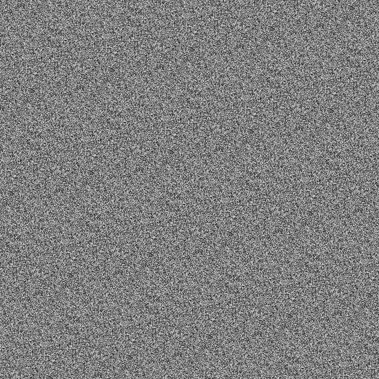
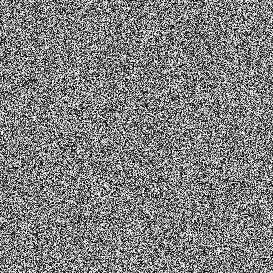

# Pseudorandom Number Generators
A simple discussion on randomising RGB lights in the [QMK discord](https://discord.gg/fBGYurv) led me down the rabbit hole of pseudorandom number generators. The original goal was replacing C library's `rand()` function with a smaller function to generate random unsigned 8-bit numbers for RGB. Experiments on a number of code sample showed that creating good RNG in 8-bit is not trivial. Documented here are noteworthy algorithms found on the Interweb.

# Evaluating PRNGs
## Visually with bitmap
While pseudorandom number generators are not of cryptography quality, we do want an algorithm that do not repeat themselves for animation and visual lighting use-cases. Rendering PRNG output as bitmap is a simple way to review for regular patterns and this [simple bitmap code](https://stackoverflow.com/questions/50090500/create-simple-bitmap-in-c-without-external-libraries) does that trick. Colours in the code loop array can be assigned the same uniform `uint8_t` output from a PRNG (`prng_function()`) to render a greyscale image:

```c
for(int row = height - 1; row >= 0; row--) {
	for(int col = 0; col < width; col++) {

		uint8_t blue, green, red;
		blue = green = red = (uint8_t)prng_function();

		buf[row * width_in_bytes + col * 3 + 0] = blue;
		buf[row * width_in_bytes + col * 3 + 1] = green;
		buf[row * width_in_bytes + col * 3 + 2] = red;
	}
}
```
The absence of pattern does not imply good output but bitmap image is a fun and quick way to detect poor one.

## Empirically with PractRand
For more serious use of PRNG output, the simple [PractRand tool](http://pracrand.sourceforge.net/) tool can be used to evaluate output quality. Ideal PRNGs should only start failing at very large output test sizes. See this post for more details on [setting up PractRand tests](https://www.pcg-random.org/posts/how-to-test-with-practrand.html).

# 32 and 64-bit PRNGs
Large state space of 32 and 64-bit is where one can find many PRNGs. They are overkill for embedded systems like QMK that rarely need big random numbers and compiled code sizes are larger than `rand()`. Nonetheless if you want something bespoke, listed in this section are interesting ones that passes PractRand tests. It is worth noting that truncated `uint8_t` output of these codes are on par with its full length results. Hence they can also be visually rendered with unsigned RGB grey values.
## PCG32
Melissa O'Neill published her paper and PCG (permuted congruential generator) family of codes at [www.pcg-random.org](https://www.pcg-random.org/). Her most robust [PCG32 code](https://www.pcg-random.org/download.html) has many versions—the following is a seeded version of 64-bit state with XORshift and random-rotation:
```c
// pcg_mcg_64_xsh_rr_32_random_r
uint32_t pcg32(void) {
	// Seed this 64bit manually
	static uint64_t state = 0x406832dd910219e5;

	uint64_t oldstate = state;
	state = state * 6364136223846793005ULL;

	uint32_t value = ((oldstate >> 18U) ^ oldstate) >> 27U;
	uint32_t rot = oldstate >> 59U;
	return (value >> rot) | (value << ((- rot) & 31));
}
```
## Xoroshiro++
Shift-register generator using [XORshift](https://en.wikipedia.org/wiki/Xorshift) was first discovered by mathematician George Marsaglia. Weaknesses of earlier implementations were improved with XORshift and rotate, [dubbed xoshiro / xoroshiro](https://prng.di.unimi.it/). The following is the general purpose and fast `xoroshiro128++` using 128-bit state (with two `uint64_t`):
```c
uint64_t rol64(uint_fast64_t const x, int const k) {
	return (x << k) | (x >> (64 - k));
}

// xoroshiro128++
uint64_t xoroshiro128pp(void) {
	// Seed both 64bit manually
	static uint64_t s0 = 0xaafdbd4fce743b4d;
	static uint64_t s1 = 0xcaee5c952c4ae6a8;

	uint64_t const t0 = s0;
	uint64_t t1 = s1;
	uint64_t const result = rol64(t0 + t1, 17) + t0;

	t1 ^= t0;
	s0 = rol64(t0, 49) ^ t1 ^ (t1 << 21); // a, b
	s1 = rol64(t1, 28); // c

	return result;
}
```
# 16-bit PRNGs
These are exponentially smaller and is more practical for embedded firmware. Small state sizes strike a good balance of output quality versus code size and its output can be type-casted to `unint8_t` as needed. These will also fail PractRand tests on smaller output.
## PCG16
The 16-bit output version of Melissa PCG code is robust enough to pass most of PractRand tests, failing at 2^30 bytes. This random-rotate version use a single 32-bit state and is a good code choice for this size:
```c
// pcg_mcg_32_xsh_rr_16_random_r
uint16_t pcg16(void) {
	// Seed this 32bit manually
	static uint32_t state = 0x406832dd;

	uint32_t oldstate = state;
	state = state * 747796405U + 1U;

	uint16_t value = ((oldstate >> 10U) ^ oldstate) >> 12U;
	uint32_t rot = oldstate >> 28U;
	return (value >> rot) | (value << ((- rot) & 15));
}
```
## xorshift16
[Brad Forschinger](http://b2d-f9r.blogspot.com/2010/08/16-bit-xorshift-rng-now-with-more.html) shrank Marsaglia's XORshift into the following simple 32-bit state (two `uint16_t`) random-shift version. It fails PractRand tests with just 2^16 bytes:
```c
uint16_t rnd_xorshift_16(void) {
	// Seed both 16bit manually
	static uint16_t x = 1, y = 1;
	uint16_t t = (x ^ (x << 5U));
	x = y * 3;
	return y = (y ^ (y >> 1U)) ^ (t ^ (t >> 3U));
}
```
## JSF16
Bob Jenkin shared [his small PRNG](http://burtleburtle.net/bob/rand/talksmall.html) that uses 128-bit state. Dubbed as 'chaotic' Jenkins Fast Small or JSF, it [was adapted to different state sizes](https://www.pcg-random.org/posts/bob-jenkins-small-prng-passes-practrand.html). Here is the 16-bit version using 64-bit internal state:
```c
#define rot16(x,k) (((x) << (k))|((x) >> (16 - (k))))
uint16_t jsf16(void) {
	static uint16_t a = 0xf1ea;
	static uint16_t b = 0x80cc, c = 0x80cc, d = 0x80cc;

	uint16_t e = a - rot16(b, 13);
	a = b ^ rot16(c, 8);
	b = c + d;
	c = d + e;
	return d = e + a;
}
```
Unlike its peers, this algorithm output will only fail PractRand at a huge 2^47 bytes (128 TB) output; making it a very good PRNG for large 16-bit samples.
# 8-bit PRNGs
This space is where limitation of state sizes become apparent. Poorly implemented linear-feedback shift register (LFSR) codes will render bitmap repetition and fail PractRand at low output sizes.
## Tzarc's XORshift
@tzarc's [version of XORshift](https://github.com/tzarc/qmk_build/blob/bebe5e5b21e99bdb8ff41500ade1eac2d8417d8c/users-tzarc/tzarc_common.c#L57-L63) was the start of this rabbit hole and his code follows:
```c
uint8_t prng(void) {
	// Seed this 8bit manually
	static uint8_t s = 0xAA, a = 0;
	s ^= s << 3;
	s ^= s >> 5;
	s ^= a++ >> 2;
	return s;
}
```
It is a modified XORshift using two 8-bit state and is the smallest. However the output fails PractRand at 2^13 bytes and produces vertical bitmap image lines:


## PCG8
An 8-bit output version of PCG can be found in the [pcg-c-basic library](https://github.com/imneme/pcg-c-basic). It runs on 16-bit state with xorshift and random-rotation:
```c
// pcg_mcg_16_xsh_rr_8_random_r
uint8_t pcg8(void) {
	// Seed this 16bit manually
	static uint16_t state = 0x6835;

	uint16_t oldstate = state;
	state = state * 12829U;

	uint8_t value = ((oldstate >> 5U) ^ oldstate) >> 5U;
	uint32_t rot = oldstate >> 13U;
	return (value >> rot) | (value << ((- rot) & 7));
}
```
Unlike its larger PCG cousins, this fails PractRand with just 2^10 bytes and its image output has visual waves:



## xshift8
Edward Rosten's [rng-4294967294](https://github.com/edrosten/8bit_rng) is a simple 32-bit state (four 8-bit registers) XORshift algorithm, using random-shift:
```c
uint8_t xshift8(void) {
	static uint8_t x = 0, y = 0, z = 0, a = 1;
	uint8_t t = x ^ (x << 5);
	x = y;
	y = z;
	z = a;
	return a = z ^ ( z >> 1) ^ t ^ (t << 3);
}
```
His simple algorithm is surprisingly robust, failing PracRand at large 2^16 bytes output and renders a pattern-free bitmap, making it a good 8-bit candidate for small systems:



## JSF8
Finally there is [Jenkin's 'chaotic' PRNG](http://burtleburtle.net/bob/rand/smallprng.html), in the adapted [8-bit output](https://www.pcg-random.org/posts/bob-jenkins-small-prng-passes-practrand.html) version that uses rotation of 32-bit internal state:
```c
#define rot8(x,k) (((x) << (k))|((x) >> (8 - (k))))
uint8_t jsf8(void) {
	static uint8_t a = 0xf1;
	static uint8_t b = 0xee, c = 0xee, d = 0xee;

	uint8_t e = a - rot8(b, 1);
	a = b ^ rot8(c, 4);
	b = c + d;
	c = d + e;
	return d = e + a;
}
```
This diminutive algorithm is both small and fast failing PractRand at a large 2^29 bytes output. Its bitmap output is also pattern free—making it the best 8-bit PRNG for embedded firmware:


# QMK compile sizes
Here is a comparison of [QMK firmware](https://github.com/qmk/qmk_firmware) sizes for each PRNG compiled with `LTO_ENABLE = yes`:

PRNG | Compiled results | Byte size
:-------------: | :-------------: | ------------- |
No PRNG | 10902 bytes free | NULL
`rand()` | 10582 bytes free | 320
`pcg32()` | 10278 bytes free | 624
`xoroshiro128pp()` | 10110 bytes free | 792
`pcg16()` | 10622 bytes free | 280
`rnd_xorshift_16()` | 10786 bytes free | 116
`jsf16()` | 10736 bytes free | 166
`prng()` | 10802 bytes free | 100
`pcg8()` | 10738 bytes free | 164
`xshift8` | 10790 bytes free | 112
`jsf8()` | 10796 bytes free | 106

# Footnote

Init code for seeding states were not include in these samples—they are seeded manually because there is no random source in a QMK keyboard. Suffice to say that codes here should not be applied on sensitive cryptography use cases–they are pseudorandom after all.

# External links
* [Visualizing the Heart of Some PRNGs](https://www.pcg-random.org/posts/visualizing-the-heart-of-some-prngs.html)
* [Permuted congruential generator](https://en.wikipedia.org/wiki/Permuted_congruential_generator)
* [Xorshift](https://en.wikipedia.org/wiki/Xorshift)
* [PractRand](http://pracrand.sourceforge.net/)
* [How to Test with PractRand](https://www.pcg-random.org/posts/how-to-test-with-practrand.html)
* [TestU01](http://simul.iro.umontreal.ca/testu01/tu01.html)
* [How to Test with TestU01](https://www.pcg-random.org/posts/how-to-test-with-testu01.html)
