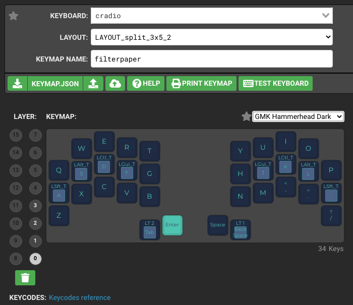
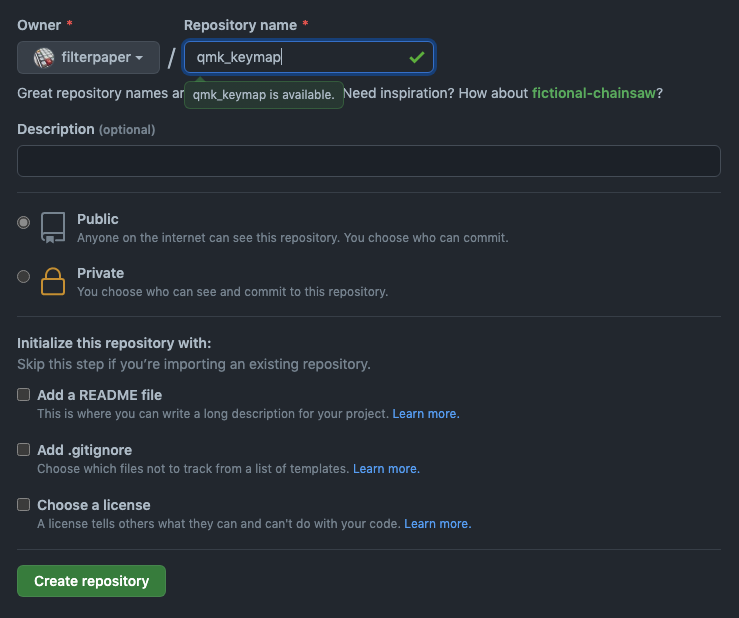
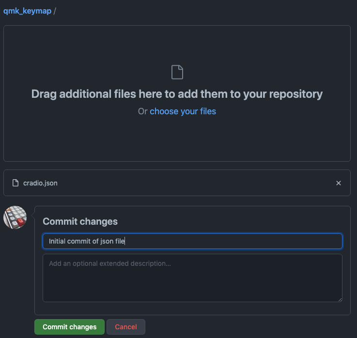
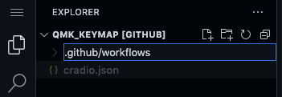
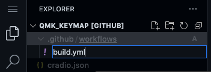
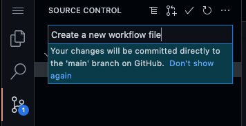
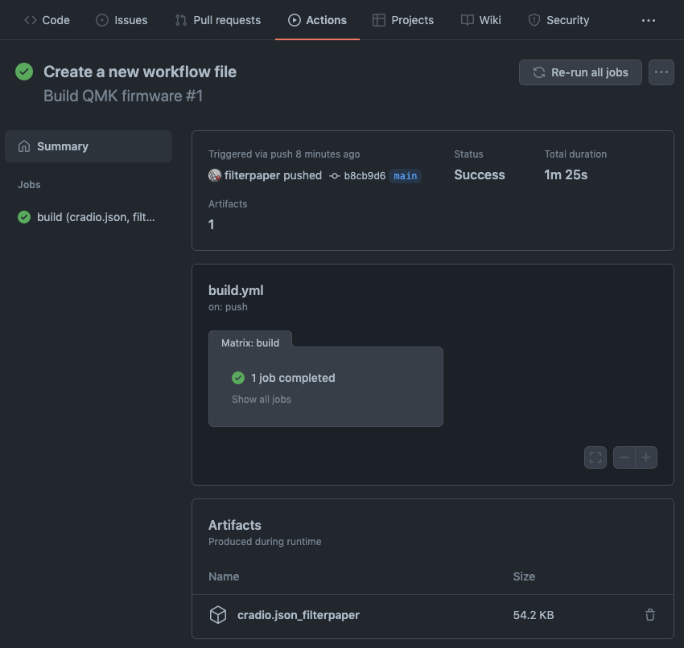

# QMK with GitHub Workflow

Building QMK firmware locally with a `git` clone of a fork and `gcc` tools can consume a lot of disk space. This is an alternative build environment that can be setup to run entirely on GitHub using Action workflow. It uses a standalone [Userspace](userspace.md) repository and a workflow that will build QMK firmware in a container. To begin, you will need an account on [GitHub](https://github.com/).


# Create a Keymap JSON

* Start by visiting the [QMK Configurator](https://config.qmk.fm/#/) site.
* Select your keyboard from the drop-down list (and choose a layout if required).
* Use your GitHub username for the `Keymap Name` field, e.g.:



* Customise the key map according to your preference.
* Select download icon next to `KEYMAP.JSON` to save the layout file locally.
* Rename the json to your keyboard name, e.g. `cradio.json`, and note its location.


# Create a Repository

* Login to your GitHub account.
* Select the `Repositories` tab, and click on `New` on the right.
* Use `qmk_keymap` (or anything unique) as the repository name.
* Leave the other settings as default and select `Create repository`:



## Upload the Keymap JSON

* In the `Quick setup` page that follows, select `uploading an existing file`.
* Locale the json file from the previous step (`cradio.json`).
* Drag that file into the browser page to upload.
* Write a meaningful commit message and select `Commit changes`:




# Create a Workflow file

Back in the `qmk_keymap` repository page, press the period (`.`) key. The [github.dev](https://docs.github.com/en/codespaces/the-githubdev-web-based-editor) web-based VSCode editor will be loaded. This interface is where you can edit and commit code directly to GitHub.

* In the left `Explorer` section, click on the `New Folder` icon to create a folder named `.github/workflows` (note the `.` prefix). Press enter to complete the action:



* Click on the new `.github/workflows` folder and select the `New File` icon. Create a file named `build.yml` and press enter to complete:



* With the `build.yml` file selected, paste the following workflow content into the editor window on the right side:

```yml

name: Build QMK firmware
on: [push, workflow_dispatch]

jobs:
  build:
    runs-on: ubuntu-latest
    container: qmkfm/base_container
    strategy:
      fail-fast: false
      matrix:
# Start of build matrix
# List the keyboard file names here
        file:
        - cradio.json
# List the username here
        user:
        - ${{ github.actor }}
# End of build matrix

    steps:

    - name: Checkout QMK
      uses: actions/checkout@v2
      with:
        repository: qmk/qmk_firmware
# Uncomment the following for develop branch
#        ref: develop
        fetch-depth: 1
        persist-credentials: false
        submodules: recursive

    - name: Checkout userspace
      uses: actions/checkout@v2
      with:
        path: users/${{ matrix.user }}
        fetch-depth: 1
        persist-credentials: false

    - name: Build firmware
      run: qmk compile "users/${{ matrix.user }}/${{ matrix.file }}"

    - name: Archive firmware
      uses: actions/upload-artifact@v2
      with:
        name: ${{ matrix.file }}_${{ matrix.user }}
        retention-days: 5
        path: |
          *.hex
          *.bin
          *.uf2
      continue-on-error: true

```

Do note that the `build.yml` requires proper indentation on every line.

## Customising the Workflow

* The matrix `file:` section is a list of keymap files to be built (`cradio.json` in the example).
* Change this to your json file name. Additional files (with `-` prefix) can be appended for multiple keyboards.
* GitHub username is default for `user:`. Change this accordingly if a different keymap name was used in [QMK Configurator](https://config.qmk.fm/#/).

## Committing the Workflow

* Select `Source Control` on the left column and enter a meaningful commit message.
* Click on the `Commit` checkmark above to commit the file directly to your repository:



Committing a change to the repository will automatically trigger build actions in the workflow.

# Review Workflow actions

* Return to your [GitHub](https://github.com/) page and the `qmk_keymap` repository.
* Select the `Actions` tab to display the `Build QMK Firmware` workflow.
* Select that workflow to display its run from the last commit.
* Successfully compiled firmware is found under the `Artifacts` section:



Download and flash the firmware file into your keyboard using [QMK Toolbox](https://docs.qmk.fm/#/newbs_flashing?id=flashing-your-keyboard-with-qmk-toolbox). If there are build errors, review the job log for details.


# Next Steps

You can proceed to customise QMK using the [Userspace guide](https://docs.qmk.fm/#/feature_userspace) with the [github.dev](https://docs.github.com/en/codespaces/the-githubdev-web-based-editor) editor:
̃
* Create a `config.h` file for QMK variables and definitions.
* Create a `rules.mk` to enable and disable QMK features.
* Create a `source.c` file for your customised code.
  * Add `SRC += source.c` to `rules.mk` to build this file.

Additional keymaps for other keyboards must be retained in json format and appended to the `file:` matrix list in `build.yml`.


# References

* [QMK Userspace guide](https://docs.qmk.fm/#/feature_userspace)
* [github.dev](https://docs.github.com/en/codespaces/the-githubdev-web-based-editor) editor
* [GitHub Actions guide](https://docs.github.com/en/actions/learn-github-actions)
